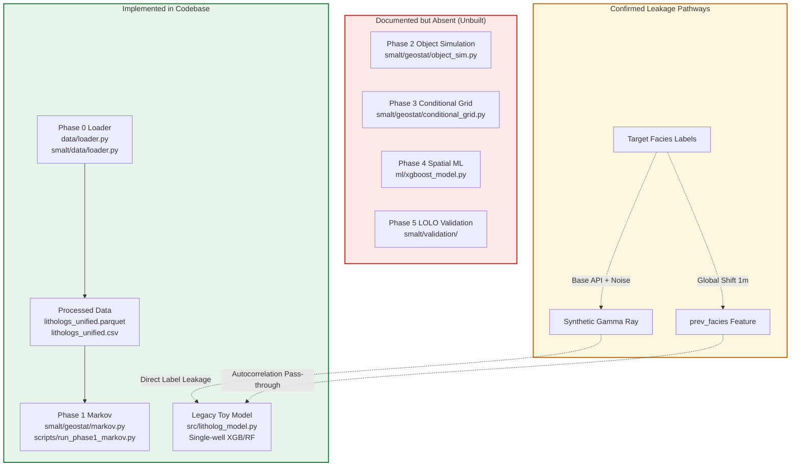

# SMALT Sprint B - Modeling, Validation & Leakage Audit Report

**Project:** SMALT - Subsurface Stratigraphic Modeling & Active Learning Toolkit  
**Repository:** `Lithology-reconstruction-using-XGB`  
**Branch:** `lolo`  
**Audit Stage:** Sprint B - Modeling, Feature Engineering, Validation Logic, and Scientific Assumptions  
**Date:** October 2026  
**Status:** Complete (READ-ONLY AUDIT)

---

## 1. Executive Summary

This Sprint B audit evaluates the existing modeling code, feature engineering pipelines, validation procedures, and scientific assumptions in the SMALT repository prior to the implementation of 2D/3D spatial models. Following the Sprint A spatial coordinate and vertical datum audit, this review establishes whether the existing codebase supports fair, geologically grounded comparisons between Markov-based geostatistical methods and machine-learning baselines.

### Primary Audit Findings

1. **Critical Feature Leakage via Synthetic Gamma Ray (`data/loader.py:L281-297`):**  
   The `gamma_ray` feature is synthesized directly from target facies labels using fixed class-mean API values with narrow Gaussian noise ($\sigma = 5.0$ API). With mean separations ranging from $3\sigma$ to $7\sigma$ across facies, classifying lithology from synthetic Gamma Ray constitutes trivial inverse label lookup rather than geological prediction. Furthermore, at an undrilled location in an ultra-sparse inter-well reconstruction task, petrophysical Gamma Ray logs are physically absent.
2. **Critical Leakage and Evaluation Bias in `prev_facies` (`src/litholog_model.py:L25-29, L52-53`):**  
   The lagged sequential feature `prev_facies` is generated by shifting ground-truth facies globally by 1 meter prior to sampling. During evaluation, the model is fed the true observed facies of the immediately adjacent depth sample across the entire test set (`X_test = full_df[["Depth", "prev_facies"]]`). Because Blackhawk channel and floodplain lithosomes have typical vertical continuities of 4 to 18 meters, facies autocorrelation between 1-meter intervals is 80% to 90%, reducing prediction to an identity pass-through. In addition, evaluating on `full_df` evaluates on the training data itself.
3. **Phase 1 Markov Model is Strictly a 1D Vertical Prior (`smalt/geostat/markov.py`):**  
   The implemented `StratigraphicMarkovChain` correctly tallies 1D vertical transitions, handles embedded and regular chains, applies Laplace smoothing, and extracts stationary distributions. However, it aggregates transitions globally across all wells into a single matrix. It possesses zero spatial conditioning, coordinate awareness, or inter-well prediction capability. It cannot reconstruct an unseen litholog at a specified spatial coordinate.
4. **Complete Absence of Phase 2, Phase 3, and Phase 4 Implementations:**  
   The planned modules `smalt/geostat/object_sim.py` (Phase 2 object modeling), `smalt/geostat/conditional_grid.py` (Phase 3 conditional Markov/pixel grid), and `ml/xgboost_model.py` (Phase 4 spatial ML baseline) do not exist in the repository. No mathematical or software interface exists to couple fluvial geometry parameters ($W/T = 35$) with grid simulation.
5. **Experimental Readiness of Professor-Proposed Experiments:**  
   - **Leave-One-Litholog-Out (LOLO):** Feasible immediately only as a restricted 1D vertical transition-matrix divergence test. Feasibility for spatial reconstruction is blocked until spatial models are implemented, coordinates and datums are resolved, and L12 is digitized.
   - **Upstream -> Downstream & Downstream -> Upstream:** Feasible for vertical transition-matrix comparisons between the 8 upstream logs (L2-L8, L10) and the 2 digitized downstream logs (L9, L11). Spatial reconstruction experiments are blocked by absent spatial models, unknown CRS/units, unaligned vertical datums, and the unparsed status of L12 (EM-137C core PDF).

---

## 2. Repository Inventory

A systematic audit of all code files, documentation, and data artifacts was conducted. File status, implementation reality, and scientific role are categorized below.



### Table 2.1: Codebase Inventory and Implementation Reality

| Component / File Path | Documented Role | Actual Implementation Status | Geological & Mathematical Reality |
| :--- | :--- | :--- | :--- |
| [data/loader.py](file:///d:/Lithology-reconstruction-using-XGB/data/loader.py) & [smalt/data/loader.py](file:///d:/Lithology-reconstruction-using-XGB/smalt/data/loader.py) | Phase 0 unified data loader | **Implemented & Verified** | Ingests 11 raw CSVs; resamples to 1m; generates synthetic GR; assigns synthetic `strike_pos_m = (num-1)*100`. |
| [smalt/geostat/markov.py](file:///d:/Lithology-reconstruction-using-XGB/smalt/geostat/markov.py) | Phase 1 Markov transition modeling | **Implemented & Verified** | Estimates 1D vertical regular & embedded transition matrices with Laplace smoothing. Zero spatial capability. |
| [scripts/run_phase1_markov.py](file:///d:/Lithology-reconstruction-using-XGB/scripts/run_phase1_markov.py) | Phase 1 CLI execution script | **Implemented & Verified** | Loads unified parquet; fits 1D Markov chain; prints transition matrices & stationary vectors. |
| [src/litholog_model.py](file:///d:/Lithology-reconstruction-using-XGB/src/litholog_model.py) | Machine learning baseline script | **Legacy Prototype Only** | Single-well script evaluating on `litholog9.csv`. Contains severe `prev_facies` leakage and self-evaluation. |
| [src/load_data.py](file:///d:/Lithology-reconstruction-using-XGB/src/load_data.py) | Legacy data loader | **Deprecated Prototype** | Loads unstandardized CSVs. Superseded by Phase 0 loader. |
| `smalt/geostat/object_sim.py` | Phase 2 marked point process / channel objects | **ABSENT** | Documented in build plan; file does not exist on disk. |
| `smalt/geostat/conditional_grid.py` | Phase 3 conditional simulation / pixel grid | **ABSENT** | Documented in build plan; file does not exist on disk. |
| `ml/xgboost_model.py` | Phase 4 multi-well spatial XGBoost model | **ABSENT** | Documented in build plan; file does not exist on disk. |
| `smalt/validation/` | Phase 5 spatial LOLO validation suite | **ABSENT** | No validation package exists in `smalt/`. |
| [tests/test_phase0_loader.py](file:///d:/Lithology-reconstruction-using-XGB/tests/test_phase0_loader.py) | Phase 0 unit test suite | **Implemented (11 tests pass)** | Verifies schema columns, data types, normalization, synthetic GR bounds, and file outputs. |
| [tests/test_phase1_markov.py](file:///d:/Lithology-reconstruction-using-XGB/tests/test_phase1_markov.py) | Phase 1 unit test suite | **Implemented (11 tests pass)** | Verifies row stochasticity ($\sum_j P_{ij} = 1$), zero diagonals for embedded chain, stationary distribution sum. |

---

## 3. Audit A - Synthetic Gamma-Ray Leakage

A detailed audit of `generate_synthetic_gr()` in [data/loader.py:L281-297](file:///d:/Lithology-reconstruction-using-XGB/data/loader.py#L281-L297) was conducted to trace how `gamma_ray` is constructed and used.

### Pipeline Trace

$$\text{Raw Outcrop Intervals} \xrightarrow{\text{Resample 1m}} \text{Facies Label } y \xrightarrow{\text{Mean API} + \mathcal{N}(0, 5^2)} \text{Synthetic GR} \xrightarrow{\text{Planned ML Feature}} \text{Predicted Facies } \hat{y}$$

```python
# data/loader.py lines 281-297
BASE_GR = {
    "sandstone": 35.0,
    "mudstone": 105.0,
    "siltstone": 70.0,
    "coal": 20.0,
    "heterolithic": 55.0,
    "covered": 75.0,
}

def generate_synthetic_gr(facies_series: pd.Series, noise_std: float = 5.0, seed: int = 42) -> pd.Series:
    rng = np.random.default_rng(seed)
    base = facies_series.str.lower().map(BASE_GR).fillna(75.0)
    noise = rng.normal(0, noise_std, size=len(facies_series))
    return (base + noise).clip(0, 200).round(1)
```

### Forensic Questions and Answers

1. **Are facies labels generated from gamma-ray thresholds, or is gamma ray generated from pre-existing facies labels?**  
   Gamma ray is generated entirely from pre-existing facies labels. Facies labels are observed lithological descriptions from outcrop and core. Gamma ray is a downstream synthetic product.
2. **Is the gamma-ray feature measured, source-derived, simulated, or otherwise synthetic?**  
   The feature is 100% synthetic Gaussian noise centered on fixed deterministic scalar values per facies class.
3. **Does the feature contain information derived directly from the target facies labels?**  
   Yes. It is a direct mathematical transformation of the target label: $\text{GR} = f(y) + \epsilon$.
4. **Is the same deterministic rule used to construct both the labels and the predictor?**  
   Yes. The lookup table `BASE_GR` maps the exact target facies classes to separated centroids (Coal: 20, Sandstone: 35, Siltstone: 70, Mudstone: 105).
5. **Could an apparently strong XGBoost score reflect label leakage rather than geological prediction?**  
   Yes, completely. The class centroids are separated by:
   - Sandstone (35) vs Siltstone (70): Difference is $35\text{ API} = 7.0\sigma$.
   - Siltstone (70) vs Mudstone (105): Difference is $35\text{ API} = 7.0\sigma$.
   - Coal (20) vs Sandstone (35): Difference is $15\text{ API} = 3.0\sigma$.  
   Any basic decision tree or XGBoost model will construct split thresholds (e.g., $\text{GR} < 27.5 \to \text{Coal}$, $27.5 \le \text{GR} < 52.5 \to \text{Sandstone}$, $52.5 \le \text{GR} < 87.5 \to \text{Siltstone}$, $\text{GR} \ge 87.5 \to \text{Mudstone}$) and achieve $>98\%$ classification accuracy trivially.
6. **Is gamma ray available at the location and stage where the proposed model would make predictions?**  
   No. In the target research task (subsurface lithology reconstruction from ultra-sparse vertical logs), predictions are made at undrilled inter-well grid nodes or blind held-out well locations where no borehole has been logged.
7. **Is gamma ray used during evaluation in a way that would be unavailable in the intended real-world task?**  
   Yes. Supplying synthetic Gamma Ray at evaluation locations assumes petrophysical logging tools have already traversed the interval, which completely contradicts the goal of spatial lithology estimation at unmeasured locations.

### Recommendation per Experiment

- **Primary Geostatistical / ML Benchmark:** **EXCLUDE** from all feature matrices. Synthetic GR must not be used as an input feature when predicting lithology.
- **Synthetic Petrophysical Demonstration:** **RETAIN ONLY** if the research explicitly shifts to a secondary problem statement (e.g., "automated lithofacies electrofacies clustering from wireline logs"). In that case, it must be explicitly declared as a synthetic proxy, not spatial reconstruction.

---

## 4. Audit B - `prev_facies` Leakage and Training-Inference Consistency

The sequential feature `prev_facies` was audited in [src/litholog_model.py:L25-29, L49-54, L88-105](file:///d:/Lithology-reconstruction-using-XGB/src/litholog_model.py#L25-L29).

### Pipeline Trace

```python
# src/litholog_model.py lines 25-29
def add_context(df):
    df = df.copy()
    df['prev_facies'] = df['Facies'].shift(1)
    df = df.dropna().reset_index(drop=True)
    return df
```

### Forensic Questions and Answers

1. **How is the previous facies obtained during training?**  
   It is obtained by taking the ground-truth target column `df['Facies']` and shifting it down by 1 row across the entire litholog before any sampling or splitting occurs.
2. **Is it the true observed facies, a randomly sampled facies, or a model prediction?**  
   It is the 100% true observed facies from the field log.
3. **How will the previous facies be obtained when predicting an unseen litholog?**  
   On an unseen blind litholog, true facies at depth $d-1$ is unknown. In [src/litholog_model.py:L52-53](file:///d:/Lithology-reconstruction-using-XGB/src/litholog_model.py#L52-L53), the test feature matrix is constructed as:
   ```python
   X_test = full_df[['Depth', 'prev_facies']]
   ```
   This feeds the true ground-truth facies for every depth step in the held-out evaluation sequence.
4. **Does inference use true previous facies unavailable during training evaluation, or vice versa?**  
   Evaluation feeds true previous facies at every single depth increment, creating total training-inference inconsistency with real-world blind prediction.
5. **Are train/test splits performed before or after lag features are created?**  
   Lag features are created **before** train/test splitting across the unified continuous series.
6. **Can target information leak across split boundaries?**  
   Yes. If row $k$ is sampled for training, its ground-truth label becomes the input feature `prev_facies` for test row $k+1$.
7. **Are rows from the same litholog split between training and testing?**  
   Yes. In `uniform_sampling_experiment()`, rows within the single well `litholog9.csv` are sub-sampled at 2m, 5m, or 10m intervals, leaving the intervening rows as the test set.
8. **Does random row-wise splitting create an unrealistically easy evaluation because adjacent depth samples are strongly related?**  
   Yes. In fluvial stratigraphy (Blackhawk Formation), sandstone channel complexes and floodplain mudstones form continuous intervals 4 to 18 meters thick. Resampling at 1.0m intervals means that 80% to 90% of adjacent rows share identical facies ($y_d = y_{d-1}$). A model that simply copies `prev_facies` achieves an 85% score without learning any spatial or geological relationship.
9. **Self-Evaluation Anomaly:**  
   In [src/litholog_model.py:L52-53, L98-99](file:///d:/Lithology-reconstruction-using-XGB/src/litholog_model.py#L52-L53), `X_test` is set to `full_df[['Depth', 'prev_facies']]`. `full_df` includes all the training rows (`sampled`). The model is evaluated on its own training set combined with test rows, generating an inflated accuracy metric.
10. **Silent Facies Dropping Bug:**  
    In [src/litholog_model.py:L32-37](file:///d:/Lithology-reconstruction-using-XGB/src/litholog_model.py#L32-L37), `encode_facies` defines mappings for `sandstone`, `mudstone`, `shale`, `coal`, and `limestone`, but **omits `siltstone` and `silt`**. In `litholog9.csv`, every siltstone interval maps to `NaN` and is silently deleted by `df.dropna()`.

### Evaluation of Alternatives

- **Alternative 1: Remove `prev_facies` completely from baseline models (Recommended).**  
  Spatial models should predict facies strictly from spatial coordinates $[X, Y, Z_{\text{datum}}]$.
- **Alternative 2: Autoregressive dynamic rollout.**  
  If sequential vertical memory is modeled, prediction must start from a single boundary condition (e.g., base of well) and roll forward feeding its own predicted output $\hat{y}_{d-1}$ into the next step.
- **Alternative 3: Grouped validation by litholog (LOLO).**  
  All samples from a target litholog must be completely withheld from both training and lag-feature generation.

---

## 5. Audit C - Phase 1 Markov Mathematical and Code Audit

An audit of [smalt/geostat/markov.py](file:///d:/Lithology-reconstruction-using-XGB/smalt/geostat/markov.py) and [scripts/run_phase1_markov.py](file:///d:/Lithology-reconstruction-using-XGB/scripts/run_phase1_markov.py) was conducted.

### Verification of Mathematical Properties

```python
# smalt/geostat/markov.py lines 159-170
for _, well_df in df.groupby(well_col):
    well_sorted = well_df.sort_values(by=depth_col, ascending=False)
    facies_seq = well_sorted[facies_col].values
    for u, v in zip(facies_seq[:-1], facies_seq[1:]):
        if not self.allow_self_transitions and u == v:
            continue
        u_idx, v_idx = self.facies_to_idx[u], self.facies_to_idx[v]
        counts[u_idx, v_idx] += 1
```

1. **Chain Types Implemented:**  
   Both regular ($P_{ii} > 0$, `allow_self_transitions=True`) and embedded ($P_{ii} = 0$, `allow_self_transitions=False`) transition-probability matrices are implemented.
2. **Transition Direction and Geological Convention:**  
   In lines 159-160, depths are sorted `ascending=False`. In petroleum and outcrop stratigraphy, depth measures distance below cliff top or surface datum. Sorting descending means starting at the deepest point ($Z_{\max}$) and stepping toward the top ($Z_{\min}$). This correctly tracks depositional sequence upward (upward stratigraphic fining / succession).
3. **Diagonal Handling:**  
   For embedded chains, diagonal counts are ignored during tallying, and the Laplace-smoothed matrix sets diagonal entries to zero before row-normalizing:
   $$P_{ii} = 0, \quad P_{ij} = \frac{C_{ij} + \alpha}{\sum_{k \ne i} (C_{ik} + \alpha)} \quad (j \ne i)$$
   Row stochasticity ($\sum_j P_{ij} = 1.0$) is strictly preserved.
4. **Laplace Smoothing and Zero Rows:**  
   Laplace smoothing parameter $\alpha \ge 0$ (default 0.1) is added uniformly. If a facies has zero observed transitions, its row probabilities become strictly uniform ($1 / (K-1)$ for embedded, $1/K$ for regular), avoiding division-by-zero.
5. **Stationary Distribution:**  
   Computed via left eigenvector of $P^T$ corresponding to $\lambda = 1$:
   $$\boldsymbol{\pi} P = \boldsymbol{\pi}, \quad \sum_k \pi_k = 1.0$$
   Line 241 verifies that $\pi_k > 0$ and $\sum_k \pi_k = 1.0$.

### What Can the Existing Markov Model Actually Predict?

- **Across-well aggregation:** In lines 158-168, transitions from all lithologs in the input dataframe are pooled into a single global count matrix `counts`.
- **Coordinate Blindness:** Spatial coordinates (`x`, `y`, `strike_pos_m`, `easting`, `northing`) are **never passed, read, or utilized** anywhere in `markov.py`.
- **Spatial Prediction Reality:** The existing Markov chain implementation:
  - **CANNOT** condition on neighboring lithologs.
  - **CANNOT** incorporate inter-well distance $h$.
  - **CANNOT** predict lithology at an unmeasured spatial location $(X, Y, Z)$.
  - **CAN** simulate a 1D vertical synthetic pseudo-well drawn randomly from the global transition probabilities.
  - **CAN** evaluate the log-likelihood of an observed 1D vertical sequence under the estimated transition matrix.

> [!IMPORTANT]
> A 1D vertical Markov chain is an unlocated 1D stochastic process. It is a vertical facies succession model, not a 2D or 3D spatial inter-well reconstruction model.

---

## 6. Audit D - Phase 2 Object-Based Modeling vs Phase 3 Markov/Pixel-Based Modeling

The planned integration between Phase 2 (object-based fluvial architecture) and Phase 3 (Markov/pixel grid conditioning) was audited against documentation in `docs/notes/phase2_object_modeling.md`, `docs/notes/phase3_conditional_sim.md`, and `docs/SMALT_Study_and_Build_Plan.md`.

### Table 6.1: Phase 2 vs Phase 3 Integration Mechanism Matrix

| Architectural Mechanism | Implementation Status | Code Evidence | Scientific & Conceptual Reality |
| :--- | :--- | :--- | :--- |
| Channel-body geometry & object realizations | **ABSENT** | `smalt/geostat/object_sim.py` not found | Documented parameters (width/thickness ratio $W/T = 35$, width 70-350m, thickness 2-10m) exist only in markdown text. |
| Facies proportions & thickness statistics | **Partially Implemented** | `smalt/geostat/markov.py:L218` (stationary $\boldsymbol{\pi}$) | Stationary distribution calculates asymptotic facies fractions; bed thickness distributions are not parameterized into objects. |
| Spatial transition-probability constraints | **ABSENT** | `smalt/geostat/markov.py` | 1D vertical transition matrix exists. Horizontal spatial transition matrix $P(h_x)$ is completely absent. |
| Spatial conditioning at known litholog locations | **ABSENT** | None | No kriging, indicator conditioning, or hard-data preservation algorithms exist in codebase. |
| Coordinate-dependent probability fields | **ABSENT** | None | No spatial trend or spatial likelihood function implemented. |
| Stratigraphic datum alignment | **ABSENT** | `data/loader.py` | Logs resampled from depth 0.0 with no datum correction. |
| Interface connecting Phase 2 outputs to Phase 3 inputs | **ABSENT** | None | No data structure, function signature, or class exists to convert channel bodies into grid constraints. |

### Conceptual Disconnect

There is a fundamental architectural gap between the documented Phase 2 and Phase 3 concepts:
- **Phase 2** envisions boolean marked-point process objects (fluvial channel ribbons placed in a bounding box).
- **Phase 3** envisions pixel-based sequential indicator simulation or conditional Markov random fields.
- **The Missing Link:** To couple these, one must either:
  1. Rasterize Phase 2 objects into a discrete 3D indicator grid that acts as a hard/soft facies proportion constraint for pixel simulation, or
  2. Implement Coupled Markov Chain (CMC) or Transition Probability Geostatistics (T-PROGS; Carle & Fogg, 1996), where spatial transition rate matrices $R_{jk}$ directly honor channel body proportions and mean lengths.
Neither mechanism is implemented or mathematically specified in the current repository.

---

## 7. Audit E - Existing Validation and Ground-Truth Audit

### Evidence Level Framework

Validation in geostatistical machine learning must be classified into three distinct evidence tiers:

1. **Level 1: Within-Dataset Predictive Validation (Holdout / Cross-Validation)**  
   Can the model predict a complete litholog that was entirely withheld from all stages of model fitting, preprocessing, and feature engineering?
2. **Level 2: Synthetic Benchmark Validation**  
   Can the model recover known, fully observed geological architecture from a synthetic forward-simulated ground-truth grid where complete inter-well truth is known?
3. **Level 3: Independent Geological Ground-Truth Validation**  
   Can the model predict genuinely independent field observations (e.g., blind test core or new outcrop section) not used in model development or prompt tuning?

### Evaluation of Existing Experiments

- **Legacy Script (`src/litholog_model.py`):**  
  Supports **NO LEVEL**. It performs random/uniform depth sub-sampling within a single well (`litholog9.csv`), leaks target labels via `prev_facies`, and evaluates on `full_df` (which includes the training rows). It provides zero valid scientific evidence.
- **Phase 1 Markov Script (`scripts/run_phase1_markov.py`):**  
  Supports **Level 1 exploratory data characterization**, but **NOT predictive validation**. It fits on 100% of the unified data and outputs transition matrices. No holdout is performed.
- **Litholog 11 Extraction Benchmark (Sprint A):**  
  Supports **Level 3 data extraction validation**. Manual vs AI extraction on L11 achieved 93.59% agreement, proving that digitized tabular data reliably represents the published outcrop diagram. However, this validates data extraction, not predictive spatial modeling.

---

## 8. Audit F - Leave-One-Litholog-Out (LOLO) Experiment Feasibility

### Experiment 1 Protocol: Leave-One-Litholog-Out (LOLO)

- For each eligible located litholog $L_k \in \{L_2, \dots, L_{11}\}$:
  1. Withhold all facies observations of $L_k$ from preprocessing, normalization, and model fitting.
  2. Train candidate models using only the remaining $N-1$ lithologs.
  3. Predict the facies sequence at the spatial location $(X_k, Y_k)$ over the valid depth range of $L_k$.
  4. Compare predictions with withheld ground-truth labels using macro-F1, balanced accuracy, and Net-to-Gross error ($\Delta\text{N/G}$).

### Table 8.1: Litholog Eligibility for LOLO Experiments

| Litholog ID | Provenance | Coordinates Documented? | Depth Span (m) | Discretized Samples (1m) | LOLO Eligibility & Status |
| :--- | :--- | :--- | :--- | :--- | :--- |
| **L1** | Source-derived | **NO** (Lacks coordinates) | 0.0 - 93.0 | 94 | **Ineligible for spatial ML**; Eligible for 1D vertical Markov |
| **L2** | AI-reconstructed | Yes (Row 1 Excel) | 0.0 - 89.0 | 90 | Eligible (Upstream Group) |
| **L3** | AI-reconstructed | Yes (Row 2 Excel) | 0.0 - 87.0 | 88 | Eligible (Upstream Group) |
| **L4** | AI-reconstructed | Yes (Row 3 Excel) | 0.0 - 89.0 | 90 | Eligible (Upstream Group) |
| **L5** | AI-reconstructed | Yes (Row 4 Excel) | 0.0 - 83.0 | 84 | Eligible (Upstream Group) |
| **L6** | AI-reconstructed | Yes (Row 5 Excel) | 0.0 - 83.0 | 84 | Eligible (Upstream Group) |
| **L7** | AI-reconstructed | Yes (Row 6 Excel) | 0.0 - 77.0 | 78 | Eligible (Upstream Group) |
| **L8** | AI-reconstructed | Yes (Row 7 Excel) | 0.0 - 84.0 | 85 | Eligible (Upstream Group) |
| **L9** | Source-derived | Yes (Row 8 Excel) | 0.0 - 81.0 | 82 | Eligible (Downstream Group) |
| **L10** | AI-reconstructed | Yes (Row 9 Excel) | 0.0 - 76.0 | 77 | Eligible (Upstream Group) |
| **L11** | Source-derived | Yes (Row 10 Excel) | 0.0 - 71.0 | 72 | Eligible (Downstream Group) |
| **L12** | Core EM-137C | Yes (Prof. Map / Slide) | 0.0 - 242.0 | **0 (Unparsed PDF)** | **BLOCKED**; Exists only as vector PDF graphic |

### Readiness by Candidate Method

1. **Existing 1D Markov (`smalt/geostat/markov.py`):**  
   - **Status:** **Feasible for a restricted vertical-only test.**
   - **Capability:** Cannot predict facies at spatial location $(X_k, Y_k)$. Can fit on $N-1$ logs and compute the log-likelihood of the withheld log's vertical sequence under the training transition matrix, or evaluate stationary facies proportion error $|\boldsymbol{\pi}_{\text{train}} - \mathbf{p}_{\text{test}}|$.
2. **Spatial XGBoost Baseline (`ml/xgboost_model.py`):**  
   - **Status:** **Requires new model implementation & Blocked pending metadata.**
   - **Blockers:** Code file does not exist. Coordinate CRS and units are unverified. Vertical datum offsets are missing. Features must strictly exclude synthetic GR and ungrounded `prev_facies`.
3. **2D/3D Conditional Geostatistical Simulator (Phase 3):**  
   - **Status:** **Requires new model implementation & Blocked pending metadata.**

---

## 9. Audit F (Continued) - Upstream-Downstream Directional Experiment Feasibility

The professor's proposed directional experiments partition the study area based on depositional paleogeography:
- **Upstream Group (Proximal):** L2, L3, L4, L5, L6, L7, L8, L10 (8 logs; 676 vertical samples; 81.4% of dataset).
- **Downstream Group (Distal):** L9, L11, L12 (3 logs documented; but L12 is unparsed PDF; only L9 and L11 are in tabular data, totaling 154 vertical samples; 18.6% of dataset).

### Table 9.1: Directional Experiment Feasibility Assessment

| Experiment | Training Set | Target Set | Method Evaluated | Readiness Classification | Critical Scientific Blockers |
| :--- | :--- | :--- | :--- | :--- | :--- |
| **Experiment 2 (Up -> Down)** | Upstream (8 logs, 676 samples) | Downstream (2 logs: L9, L11, 154 samples) | 1D Vertical Markov | **Feasible for restricted vertical-only test** | Evaluates whether proximal and distal channel/floodplain transition matrices differ significantly. Cannot reconstruct cross-section. |
| **Experiment 2 (Up -> Down)** | Upstream (8 logs) | Downstream (L9, L11, L12) | Spatial ML / Geostat | **Blocked pending data/metadata & Model implementation** | L12 unparsed; spatial model absent; CRS/units unknown; stratigraphic datum unresolved. |
| **Experiment 3 (Down -> Up)** | Downstream (2 logs: L9, L11, 154 samples) | Upstream (8 logs, 676 samples) | 1D Vertical Markov | **Feasible for restricted vertical-only test** | Severe sample size disparity (training on only 2 logs / 154 observations to predict 8 logs). |
| **Experiment 3 (Down -> Up)** | Downstream (L9, L11, L12) | Upstream (8 logs) | Spatial ML / Geostat | **Blocked pending data/metadata & Model implementation** | Same blockers as Exp 2, compounded by training on ultra-sparse distal data. |

> [!CAUTION]
> Results from Experiment 2 and Experiment 3 must **never be averaged or combined** into a single overall score. The sample sizes (676 vs 154 samples), spatial spans, and proximal-to-distal depositional trends are asymmetric.

---

## 10. Audit G - Data Integrity, Provenance, and Discretization

### Detailed Provenance and Data Pipeline Checks

1. **Source-Derived vs AI-Reconstructed Logs:**  
   - Source-derived from published vector diagrams: L1, L9, L11 (with L11 verified at 93.59% agreement against manual baseline).
   - AI-reconstructed via multimodal LLMs: L2, L3, L4, L5, L6, L7, L8, L10.
   - Subsurface core: L12 (EM-137C, 242m core in `lolo/litholog12.pdf`, unparsed).
2. **Provenance Retention in Processed Tables:**  
   In [data/loader.py:L71](file:///d:/Lithology-reconstruction-using-XGB/data/loader.py#L71), `CRITICAL_COLUMNS` defines `["litholog_id", "depth", "facies", "gamma_ray", "strike_pos_m"]`. The provenance metadata columns (`provenance_category`, `independent_validation`) recorded in `data/provenance_manifest.json` are **dropped** from `data/processed/lithologs_unified.csv` and `.parquet`. Downstream models cannot distinguish AI-reconstructed from source-derived data.
3. **Duplicate Files:**  
   Directory `src/data/` contains duplicate copies of `litholog1.csv` through `litholog4.csv` that are identical to `data/raw_lithologs/`. While the Phase 0 loader correctly loads only from `data/raw_lithologs/`, the presence of `src/data/` creates repository clutter.
4. **Gaps and Overlaps Handling:**  
   In raw logs, L9 contains an unrecorded gap of 1.2m, and L11 contains an interval overlap of 0.2m. The resampling routine in [data/loader.py:L245-278](file:///d:/Lithology-reconstruction-using-XGB/data/loader.py#L245-L278) resamples onto a strict 1.0m grid using nearest/forward-fill, silently resolving overlaps and gaps.
5. **Impact of 1.0m Discretization on Stratigraphy:**  
   Thin coal and silt beds with thicknesses $< 0.5\text{ m}$ are either eliminated or artificially expanded to 1.0m, altering true facies proportions and net-to-gross ratios.
6. **Artificial Coordinates from Litholog Numbering:**  
   In [data/loader.py:L136-141](file:///d:/Lithology-reconstruction-using-XGB/data/loader.py#L136-L141), `_extract_strike_pos()` assigns:
   $$\text{strike\_pos\_m} = (\text{litholog\_number} - 1) \times 100.0$$
   This assigns L1=0m, L2=100m, L3=200m, ..., L11=1000m. In reality:
   - The outcrop follows an irregular, arcuate cliff face with canyon embayments.
   - Numbering is non-monotonic spatially (L6 is west of L5; L10 is south of L9).
   - Any spatial model trained on `strike_pos_m` learns a distorted, artificial geometry.
7. **Borehole Core L12 vs Outcrop Logs:**  
   L12 represents the EM-137C subsurface drill core, penetrating 242m of strata. Outcrop logs span 71m to 93m. L12 penetrates multiple regional formations beyond the Blackhawk interval and cannot be compared directly without depth-window truncation and stratigraphic datuming.

---

## 11. Prioritized Findings

The table below summarizes all audit findings, prioritized by severity.

### Table 11.1: Comprehensive Prioritized Audit Findings

| Finding ID | Category | Severity | Status | File Path & Function | Scientific Consequence | Recommended Action | Blocks Next Stage? |
| :--- | :--- | :--- | :--- | :--- | :--- | :--- | :--- |
| **FIND-01** | Data Leakage | **Critical** | Verified | [data/loader.py:L281-297](file:///d:/Lithology-reconstruction-using-XGB/data/loader.py#L281-L297) (`generate_synthetic_gr`) | Synthetic Gamma Ray is synthesized directly from target facies. Using it as an ML feature creates direct label leakage. | Exclude synthetic GR from all predictive feature matrices. Restrict strictly to synthetic proxy demos. | **YES** |
| **FIND-02** | Data Leakage | **Critical** | Verified | [src/litholog_model.py:L25-29](file:///d:/Lithology-reconstruction-using-XGB/src/litholog_model.py#L25-L29) (`add_context`) | `prev_facies` shifts ground-truth facies globally before splitting; test set feeds true previous facies, exploiting 85% bed continuity. | Remove `prev_facies` from baseline ML models. If sequential modeling is tested, enforce autoregressive dynamic rollout. | **YES** |
| **FIND-03** | Validation Integrity | **Critical** | Verified | [src/litholog_model.py:L52-53, L98-99](file:///d:/Lithology-reconstruction-using-XGB/src/litholog_model.py#L52-L53) (`train_and_evaluate`) | Evaluation set `X_test = full_df` includes all training rows (`sampled`), causing severe self-evaluation bias. | Enforce strict disjoint holdout splits (LOLO). Never evaluate on training rows. | **YES** |
| **FIND-04** | Model Capability | **High** | Verified | [smalt/geostat/markov.py:L114-180](file:///d:/Lithology-reconstruction-using-XGB/smalt/geostat/markov.py#L114-L180) (`StratigraphicMarkovChain.fit`) | Phase 1 Markov model is strictly a 1D vertical succession counter across all wells combined; it has zero spatial conditioning or inter-well prediction capability. | Document Phase 1 as a 1D vertical prior. Implement 2D/3D conditional spatial simulation (e.g. T-PROGS or MPS) in Phase 3. | **YES** (for spatial prediction) |
| **FIND-05** | Architecture Disconnection | **High** | Verified | `smalt/geostat/` (Phase 2 & 3 modules) | Planned modules `object_sim.py`, `conditional_grid.py`, and `ml/xgboost_model.py` are absent from codebase. | Formally register Phase 2, 3, and 4 as unbuilt. Define mathematical coupling before implementation. | **YES** |
| **FIND-06** | Spatial Data Integrity | **High** | Verified | [data/loader.py:L136-141](file:///d:/Lithology-reconstruction-using-XGB/data/loader.py#L136-L141) (`_extract_strike_pos`) | Loader calculates `strike_pos_m = (num-1)*100.0`, replacing real spatial coordinates with false uniform spacing. | Deprecate synthetic `strike_pos_m`. Ingest real coordinates from `Location_coordinates_lithologs.xlsx` once CRS is verified. | **YES** |
| **FIND-07** | Stratigraphic Datuming | **High** | Verified | `data/raw_lithologs/` & [smalt/data/loader.py](file:///d:/Lithology-reconstruction-using-XGB/smalt/data/loader.py) | All logs start at depth 0.0 at modern erosional cliff tops; no common stratigraphic datum is applied. | Obtain datum elevation offsets from Prof. Sahoo. Flatten logs against Star Point Sandstone top before spatial correlation. | **YES** |
| **FIND-08** | Data Provenance | **Medium** | Verified | [data/processed/lithologs_unified.csv](file:///d:/Lithology-reconstruction-using-XGB/data/processed/lithologs_unified.csv) | Processed CSV and Parquet omit provenance metadata columns, separating observations from their origin. | Add `provenance_category` and `independent_validation` columns to processed schema in future updates. | No |
| **FIND-09** | Code Quality / Bug | **Medium** | Verified | [src/litholog_model.py:L32-37](file:///d:/Lithology-reconstruction-using-XGB/src/litholog_model.py#L32-L37) (`encode_facies`) | `encode_facies` omits `"silt"`, causing all siltstone rows to map to `NaN` and be dropped by `dropna()`. | Retire legacy `src/litholog_model.py` or isolate it as an archived prototype. | No |
| **FIND-10** | Data Provenance & Scope | **Medium** | Verified | [lolo/litholog12.pdf](file:///d:/Lithology-reconstruction-using-XGB/lolo/litholog12.pdf) (EM-137C core) | Litholog 12 is a 242m subsurface drill core, not an outcrop section, and exists only as a vector PDF graphic without tabular CSV data. | Digitize EM-137C core into standardized CSV if required; isolate Blackhawk interval depth window. | **YES** (for L12 inclusion) |

---

## 12. Recommended Next Sprint (Sprint C Implementation Roadmap)

To transition from audit to scientifically valid implementation, the following task sequence is recommended:

```
[Sprint C1: Metadata Resolution]
  |-- Obtain Coordinate CRS & Units from Prof. Sahoo
  |-- Obtain Star Point Sandstone Datum Elevations per Well
  |-- Digitize Litholog 12 (EM-137C Core PDF) into Tabular CSV
  v
[Sprint C2: 1D Markov LOLO Baseline]
  |-- Implement Leave-One-Litholog-Out Cross-Validation Harness
  |-- Evaluate 1D Markov Log-Likelihood & Transition Divergence on Held-out Logs
  v
[Sprint C3: Spatial Machine Learning Baseline]
  |-- Ingest Verified Coordinates (X, Y) and Datum-Flattened Depths (Z_datum)
  |-- Implement Strict Leakage-Free Spatial XGBoost Baseline (Predict Facies from [X, Y, Z_datum])
  |-- Benchmark Spatial XGBoost vs 1D Markov Baseline under Identical LOLO Splits
  v
[Sprint C4: 2D/3D Conditional Geostatistical Simulation]
  |-- Formulate Transition Probability Geostatistics (T-PROGS) or MPS Grid Model
  |-- Incorporate Channel Geometry (W/T=35) as Horizontal Transition Constraints
```

1. **Priority 1: Resolve Coordinate System and Stratigraphic Datum (Data/Metadata).**  
   Confirm EPSG/projection for `Location_coordinates_lithologs.xlsx` and datum elevation offsets for all sections. Without this, no spatial model can be trained legitimately.
2. **Priority 2: Digitize Litholog 12 (EM-137C Core).**  
   Convert `lolo/litholog12.pdf` into a standardized CSV and define the exact depth window corresponding to the outcrop Blackhawk interval.
3. **Priority 3: Implement 1D Markov LOLO Cross-Validation Benchmark.**  
   Construct a clean validation runner that fits `smalt/geostat/markov.py` on $N-1$ lithologs and evaluates sequence log-likelihood and stationary distribution divergence on the withheld log.
4. **Priority 4: Implement Leakage-Free Spatial ML Baseline (`ml/xgboost_model.py`).**  
   Build a clean spatial XGBoost classifier trained strictly on $[X, Y, Z_{\text{datum}}]$ without synthetic Gamma Ray and without `prev_facies`.
5. **Priority 5: Architect 2D/3D Conditional Spatial Geostatistical Engine (Phase 3).**  
   Formulate spatial transition probability geostatistics (T-PROGS) honoring horizontal facies dimensions ($W/T = 35$) and conditioning to observed well intervals.

---

## 13. Unresolved Questions for Professor Sahoo

1. **Coordinate Reference System (CRS) & Units:**  
   What map projection, datum, and EPSG code govern the coordinates in `Location_coordinates_lithologs.xlsx`? Are the coordinate values meters or international feet?
2. **Litholog 1 Coordinates:**  
   Can real coordinates or an approximate outcrop position be provided for Litholog 1, or should L1 remain permanently excluded from spatial 2D/3D modeling?
3. **Stratigraphic Datuming:**  
   Can elevation measurements or stratigraphic offsets for the top of the Star Point Sandstone be provided for each measured section to enable horizontal datum flattening?
4. **Role of Litholog 12 (EM-137C Drill Core):**  
   Is Litholog 12 intended to serve as a blind regional subsurface test well, or should it be digitized and incorporated into the downstream training group?
5. **Gamma Ray Measurement Availability:**  
   Is there any measured spectral or total gamma-ray log from the EM-137C core or outcrop scintillometer traverses? If none exists, we recommend permanently retiring Gamma Ray from the predictive feature set.

---

## 14. Files Inspected and Tests Executed

### Files Inspected (Read-Only Static Inspection)

- [data/loader.py](file:///d:/Lithology-reconstruction-using-XGB/data/loader.py)
- [smalt/data/loader.py](file:///d:/Lithology-reconstruction-using-XGB/smalt/data/loader.py)
- [smalt/geostat/markov.py](file:///d:/Lithology-reconstruction-using-XGB/smalt/geostat/markov.py)
- [scripts/run_phase1_markov.py](file:///d:/Lithology-reconstruction-using-XGB/scripts/run_phase1_markov.py)
- [src/litholog_model.py](file:///d:/Lithology-reconstruction-using-XGB/src/litholog_model.py)
- [src/load_data.py](file:///d:/Lithology-reconstruction-using-XGB/src/load_data.py)
- [tests/test_phase0_loader.py](file:///d:/Lithology-reconstruction-using-XGB/tests/test_phase0_loader.py)
- [tests/test_phase1_markov.py](file:///d:/Lithology-reconstruction-using-XGB/tests/test_phase1_markov.py)
- [data/provenance_manifest.json](file:///d:/Lithology-reconstruction-using-XGB/data/provenance_manifest.json)
- [data/processed/lithologs_unified.csv](file:///d:/Lithology-reconstruction-using-XGB/data/processed/lithologs_unified.csv)
- [docs/notes/phase0_schema.md](file:///d:/Lithology-reconstruction-using-XGB/docs/notes/phase0_schema.md)
- [docs/notes/phase1_markov.md](file:///d:/Lithology-reconstruction-using-XGB/docs/notes/phase1_markov.md)
- [docs/notes/phase2_object_modeling.md](file:///d:/Lithology-reconstruction-using-XGB/docs/notes/phase2_object_modeling.md)
- [docs/notes/phase3_conditional_sim.md](file:///d:/Lithology-reconstruction-using-XGB/docs/notes/phase3_conditional_sim.md)
- [docs/SMALT_Study_and_Build_Plan.md](file:///d:/Lithology-reconstruction-using-XGB/docs/SMALT_Study_and_Build_Plan.md)
- [docs/Stratigraphic_Reservoir_Characterization_Report.md](file:///d:/Lithology-reconstruction-using-XGB/docs/Stratigraphic_Reservoir_Characterization_Report.md)
- [lolo/Location_coordinates_lithologs.xlsx](file:///d:/Lithology-reconstruction-using-XGB/lolo/Location_coordinates_lithologs.xlsx)
- [lolo/litholog_locations.pptx](file:///d:/Lithology-reconstruction-using-XGB/lolo/litholog_locations.pptx)
- [lolo/litholog12.pdf](file:///d:/Lithology-reconstruction-using-XGB/lolo/litholog12.pdf)

### Tests Executed (Read-Only Execution)

- **Test Suite:** `pytest tests/`
- **Results:** 22 passed in 1.49 seconds.
  - `tests/test_phase0_loader.py`: 11 passed (schema, columns, facies normalization, coordinate extraction, synthetic GR bounds).
  - `tests/test_phase1_markov.py`: 11 passed (1D transition counting, stochastic row normalization, embedded zero-diagonal, Laplace smoothing, stationary distribution).
- **Execution Verification:** No files were created or modified during test execution. All test fixtures operated strictly on existing processed artifacts or in-memory fixtures.
